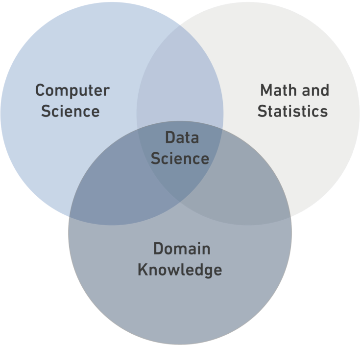

# Data Science
  ## What is Data Science?  
  **Data Science** is a _multidisciplinary_ field that combines statistics, computer science, and domain knowledge.   


  ### Data Types:
 - Structural Data
 - Semi-Structural Data
 - Unstructured Data

Learn more about Data Science on [Wikipedia](https://en.wikipedia.org/wiki/Data_science).

 
| Structural  | Semi-Structural  |	
|--|--|
|Is it data that has been organize into a strict schema.  |Is it data that does not conform to a schema but has some structure.   |
|--|--|
|e.g: tables  |e.g:xml  |


```python 
print("DS Bootcamp")
